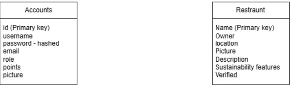
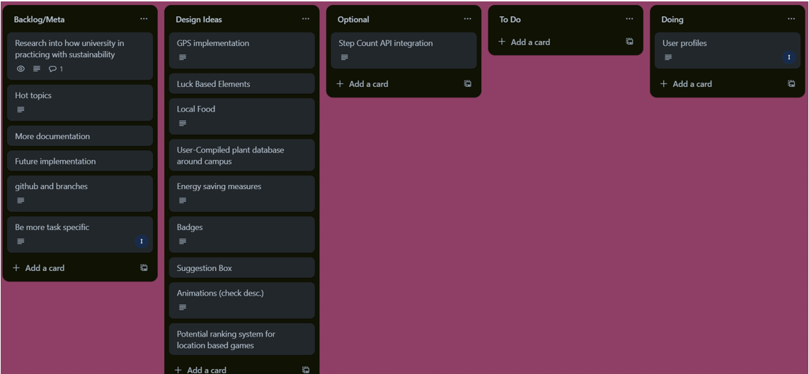
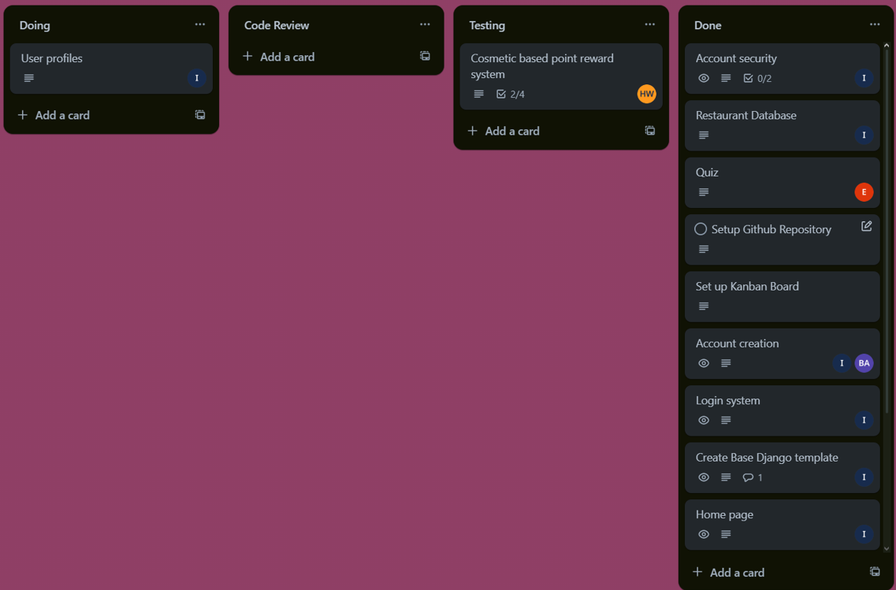
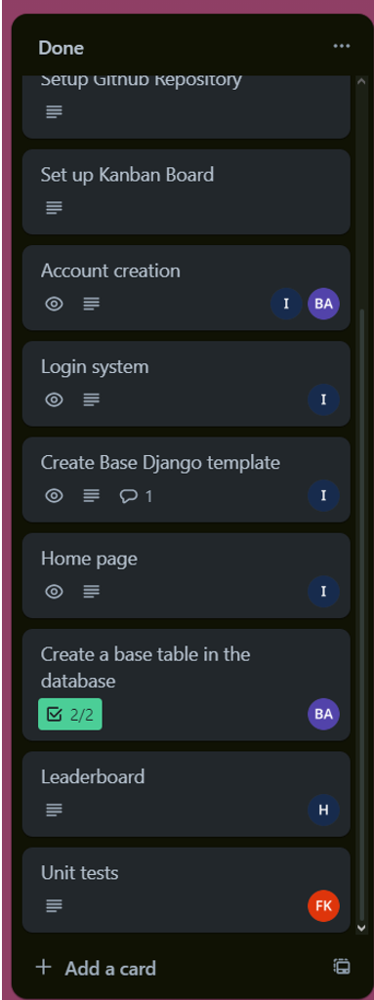

# Sprint 1 Summary - Sustainability Gamification App

## Overview

Sprint 1 focused on building the foundation of the **Sustainability Gamification App**, implementing essential features, and addressing initial technical challenges. The primary goal was to establish user authentication, gamification mechanics, and the groundwork for future expansions.

---

## 1. Work Completed

### 1.1 System Architecture & Database Design

- Established a **Model-View-Template (MVT) architecture** using Django.
- Designed and implemented **database models** for user authentication, points, quizzes, and restaurant check-ins.
- Created a structured approach for managing user profiles and sustainability-related data.
  

### 1.2 Core Features Implemented

- **User Authentication:**
  - Registration and login system implemented using Django’s built-in authentication.
  - Custom user profiles created to store sustainability points and additional data.
- **Gamification & Points System:**
  - Users earn points for completing quizzes and check-ins.
  - A Leaderboard ranks users based on their total points.
- **Sustainability Quiz:**
  - Users can answer sustainability-related questions to earn points.
- **QR Code Check-In System (Prototype):**
  - Users can check into predefined locations (though mobile scanning is still under development).
- **Restaurant Listings:**
  - Admins can add verified sustainable restaurants to the database.

---

## 2. Challenges Faced & Solutions

### 2.1 Implementing the Quiz System

- Initially followed an online tutorial to create the quiz system.
- Struggled with adapting it to the project’s unique requirements.
- Faced difficulties working across multiple operating systems (Windows, Linux, and laptop setup).
- Eventually integrated quiz points with another team member’s UI.

### 2.2 Passing User Profiles to Relevant Pages

- Encountered issues ensuring user profiles were correctly passed to search results, editing pages, and other linked forms.
- Required retrofitting URLs and adjusting forms to accommodate profile data properly.
- Successfully resolved through updates to URL routing and form handling.

### 2.3 Styling Login & Registration Forms

- Django’s auto-generated forms (from forms.py) were difficult to modify with basic HTML & CSS.
- Customization is still in progress, requiring more control over form rendering.

### 2.4 QR Scanner Limitations

- QR scanner works successfully on PC browsers but does not function correctly when accessed via mobile devices.
- Further development is needed to ensure cross-device compatibility.

---

## 3. Future Plans for Sprint 2

### 3.1 Feature Expansions

- Improve points & rewards system, including new ways to earn points.
- Implement verified check-in system using QR codes for sustainability locations.
- Expand the challenge system to include more interactive sustainability tasks.

### 3.2 UI/UX Enhancements

- Improve design and styling for login, registration, and leaderboard.
- Add animations and user-friendly layouts for better engagement.

### 3.3 Testing & Security

- Expand test coverage for login, quiz, and leaderboard.
- Ensure GDPR compliance with secure data handling and user consent mechanisms.

**Sprint 1 has successfully laid the foundation for our sustainability gamification** platform. Future sprints will focus on refining features, improving UI/UX, and enhancing overall functionality.

